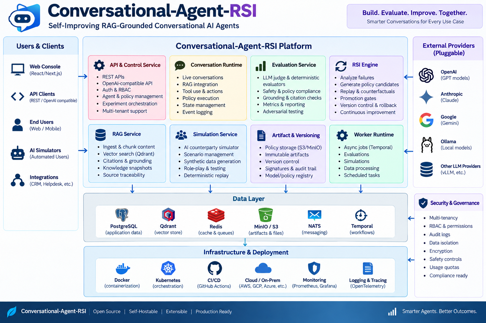
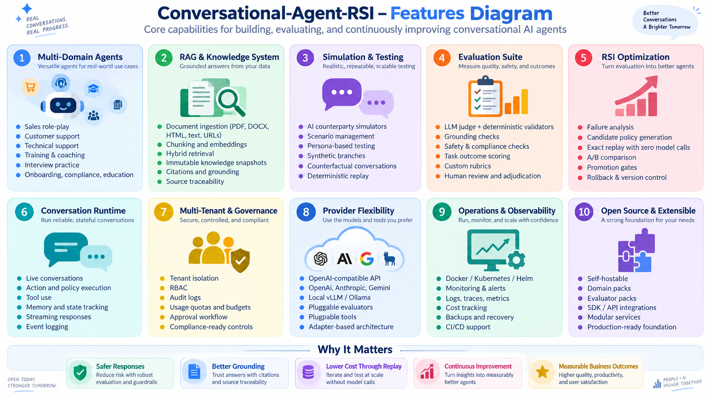
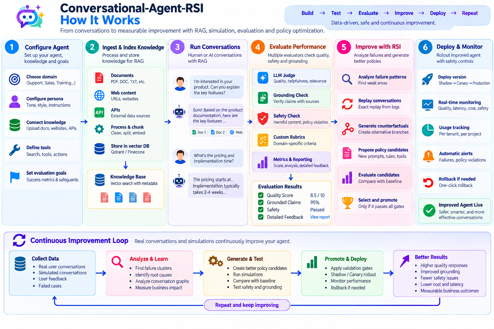
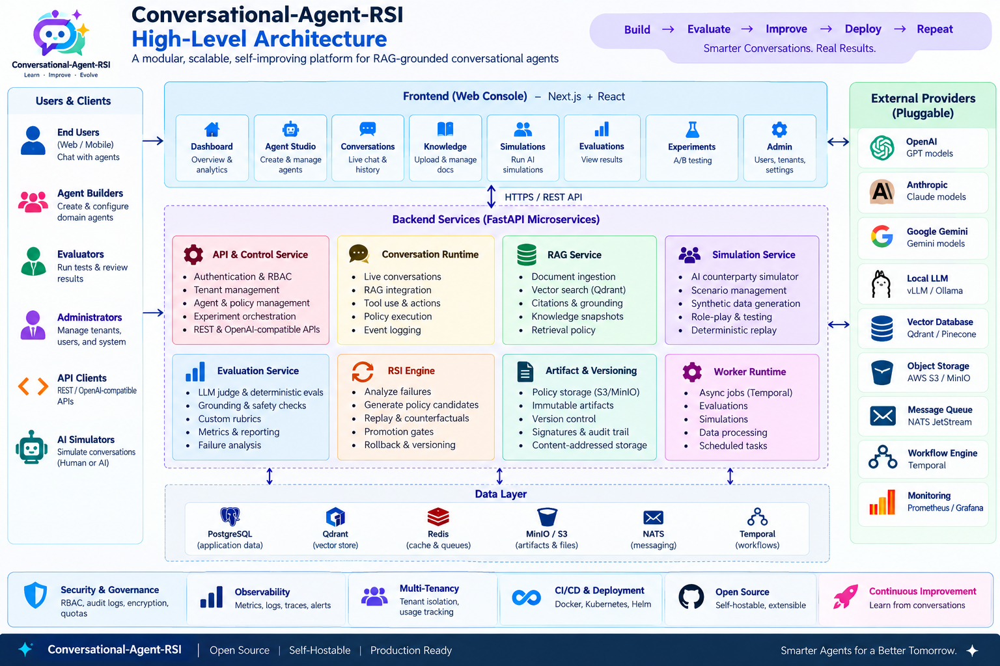

# Conversational-Agent-RSI

Open-source-first, self-hostable platform for building, evaluating, replaying, and safely improving RAG-grounded conversation agents. It implements harness-level recursive self-improvement around a frozen base model. It does not modify foundation-model weights.



## Included

- Multi-tenant FastAPI control plane and conversation runtime
- Immutable conversation event graph and state projections
- Declarative hierarchical policy DSL with hashing, semantic diff, validation, protected fields, and HMAC signing
- RAG ingestion/retrieval adapter contracts, Qdrant adapter, immutable snapshot metadata, citation objects
- Scenario/persona simulation, reverse role-play, deterministic simulator and model-backed adapters
- Evaluator ensemble with deterministic, grounding, safety, outcome, and LLM-judge hooks
- Exact replay with zero model calls; semantic/counterfactual replay interfaces with synthetic provenance
- RSI candidate generation, mutation operators, Pareto comparison, coverage checks, promotion gates, canary/rollback state machine
- Hierarchical budgets and append-only usage ledger
- RBAC, audit events, idempotency, tenant isolation, kill switches
- OpenAI-compatible `/v1/chat/completions`
- Next.js web console for dashboard, agents, conversations, knowledge, simulations, evaluations, experiments, deployments, reviews, and admin
- Three reference domain packs
- Docker Compose, Helm, CI, tests, seed data, docs



## How it works



## Quick start

### 1. Full Stack Server (Docker Compose)

The fastest way to spin up the entire platform (PostgreSQL, Redis, Qdrant, MinIO, NATS, Temporal, FastAPI API, Worker, and Next.js Web Console):

```bash
cp .env.example .env
make dev
```

Then open:

- Web console: http://localhost:3000
- API docs: http://localhost:8000/docs
- Health: http://localhost:8000/healthz

### 2. Detailed Guides

For dedicated step-by-step setup and configuration instructions, see:

- **macOS Server & Dev Mode Setup Guide**: [docs/operations/server-and-dev-setup-macos.md](docs/operations/server-and-dev-setup-macos.md) (covers Apple Silicon / Intel prerequisites, full Docker server mode, hybrid hot-reload dev mode, and zero-Docker smoke mode)
- **Configuration Guide**: [docs/operations/configuration-guide.md](docs/operations/configuration-guide.md) (covers all environment variables, authentication, database connection strings, S3/MinIO, vector search, model gateways, and budgets)
- **Operations Runbook**: [docs/operations/runbook.md](docs/operations/runbook.md) (covers backup, restore, and incident controls)

### 3. Lightweight Backend Smoke Run (Zero Docker)

For rapid offline unit testing and smoke development without Docker:

```bash
python3.12 -m venv .venv
source .venv/bin/activate
pip install -e ".[dev]"
export DATABASE_URL=sqlite+aiosqlite:///./rsi.db
export DEV_AUTH_ENABLED=true
alembic upgrade head
python scripts/seed.py
uvicorn apps.control_api.main:app --reload
```

## Architecture

The repository follows the PRD service boundaries. The local profile intentionally deploys the Python services from one image while preserving typed module boundaries. Production Helm values allow independent scaling of API, runtime, RAG, simulation, evaluation, RSI, registry, and worker workloads.



See `docs/architecture/overview.md`, `docs/security/security-model.md`, and `docs/domain-pack-guide/README.md`.

## Safety and improvement boundary

Experiments freeze the model route, evaluator suite, safety policy, knowledge snapshot, permissions, and budget. Candidates may mutate only allowlisted policy fields. Production promotion requires hard-constraint checks, held-out results, coverage, confidence, budget, and approval gates. Exact replay reads stored observations and records zero new model usage.

## License

Apache-2.0. This repository is a clean-room implementation based on the supplied PRD and does not copy Dream-RSI or Open Dream-RSI source code.
